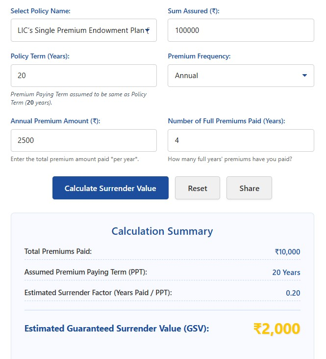

# LIC Policy Surrender Value Calculator

Live working calculator built with HTML, CSS and JavaScript.

🔗 **Live Demo (GitHub Pages):**  
 https://calculatordekho.github.io/lic-policy-surrender-value-calculatorgithub.io/
---

## Calculator Preview

## 🧾 Introduction  

When people buy life insurance today, they don’t just think about protection. They also think about investment, returns and flexibility. Because of this, many policyholders sometimes decide to stop or surrender their policy before maturity.  

The biggest question is always the same:  

> “If I surrender my policy now, how much money will I get back?”  

This is where a **YLIC Policy Surrender Value Calculator** becomes extremely useful.  

Instead of guessing or waiting for an agent to tell you, a surrender value calculator helps you **estimate your policy’s surrender amount in advance**. This lets you decide whether surrendering is a smart decision or a costly mistake.  

In this guide, you’ll learn:  

- What a YLIC Policy Surrender Value Calculator is  
- How surrender value is decided  
- The basic formula (with examples)  
- Factors that increase or reduce surrender value  
- How to check surrender value online  
- Surrender vs maturity vs loan on policy  
- Tax impact of surrender  
- Real-life examples and comparison tables  
- FAQs about surrender value and calculators  

If you are planning to surrender a policy or just want to understand your options better, this detailed yet easy-to-understand guide on the **YLIC Policy Surrender Value Calculator** is for you.  

---

## 💡 What Is a YLIC Policy Surrender Value Calculator?  

A **YLIC Policy Surrender Value Calculator** is a simple online tool that estimates how much money you will receive if you surrender (cancel) your life insurance policy before maturity.  

When you surrender a policy early, the company does **not** pay the full sum assured. Instead, it pays a reduced amount called the **surrender value**.  

In simple words:  

> **Surrender Value = The amount you get when you close your policy before maturity.**  

A surrender value calculator helps you:  

- Get a quick estimate of surrender value  
- Compare surrender amount vs maturity benefits  
- Decide whether to surrender, continue, or take a loan on the policy  

For LIC-type policies, many people use online tools. For example, you can check surrender value for LIC-type policies using this tool:  

👉 **LIC Policy Surrender Value Calculator** – https://calculatordekho.com/lic-policy-surrender-value-calculator/  

Even if your policy is from YLIC or a similar insurer, the **logic and concept of surrender value remain very similar**.  

---

## 📊 How Is YLIC Policy Surrender Value Decided?  

The surrender value of a YLIC policy is not random. It depends on several key factors:  

- **Type of policy**  
  - Endowment, Money Back, ULIP, Whole Life, etc.  
- **Policy term**  
  - Total duration such as 10, 15, 20 or 25 years  
- **Premium payment term**  
  - How many years you are supposed to pay premiums  
- **Total premium paid so far**  
  - The total amount you have already deposited  
- **Accrued bonuses** (for traditional policies)  
  - Reversionary bonus, loyalty additions, etc.  
- **Surrender value factor**  
  - A percentage decided by the company based on how long the policy has run  
- **Policy status**  
  - Active, paid-up or lapsed  

### 🔍 Real-Life Example  

Imagine Anita has a 20-year YLIC endowment policy.  

- Annual premium: ₹40,000  
- Premiums paid: 8 years  
- Total premium paid: ₹3,20,000  
- The policy has accrued some bonus over the years.  

Anita now wants to stop the policy. Instead of blindly surrendering, she uses a **YLIC Policy Surrender Value Calculator** to estimate how much she will get back. She realizes that the surrender value is much lower than the maturity value and decides to continue for a few more years.  

This is the power of using a calculator before taking a decision.  

---

## 📐 Basic Formula Used in YLIC Policy Surrender Value Calculator  

Different companies may use slightly different methods, but the general idea behind the **YLIC Policy Surrender Value Calculator** is similar. A simplified formula is:  

> **Guaranteed Surrender Value = (Total Premium Paid × Surrender Value Factor) + Accrued Bonus**  

Where:  

- **Total Premium Paid** = sum of all premiums you have paid so far  
- **Surrender Value Factor** = a percentage (like 30%, 40%, etc.) based on how many years have been completed  
- **Accrued Bonus** = bonus accumulated on the policy till date (for traditional plans)  

### 🧮 Example Calculation  

Assume:  

- Annual premium: ₹50,000  
- Years paid: 6  
- Total premium paid: ₹3,00,000  
- Surrender value factor: 30%  
- Accrued bonus: ₹40,000  

Now:  

- Guaranteed surrender part = ₹3,00,000 × 30% = ₹90,000  
- Add bonus: ₹90,000 + ₹40,000 = ₹1,30,000  

**Estimated Surrender Value ≈ ₹1,30,000**  

This is exactly the kind of calculation that a **YLIC Policy Surrender Value Calculator** automates for you.  

---

## 🌐 How to Use a YLIC Policy Surrender Value Calculator Online  

Using an online surrender value calculator is usually very easy and quick.  

### Step-by-Step Guide  

1. **Open the calculator page**  
   - Use a trusted financial site or calculator tool.  
   - For example, for LIC-style policies, you can use:  
     👉 https://calculatordekho.com/lic-policy-surrender-value-calculator/  
2. **Select policy type**  
   - Endowment, ULIP, Money Back, etc.  
3. **Enter policy term**  
   - Example: 20 years, 25 years, etc.  
4. **Enter premium details**  
   - Annual or monthly premium amount  
   - Number of years you have already paid  
5. **Enter bonus details (if known)**  
   - Approximate bonus amount accrued  
6. **Click “Calculate”**  
   - The calculator will show an estimated surrender value within seconds.  

### 💼 Practical Use Case  

Rohit urgently needs money for medical expenses. He is thinking about surrendering his YLIC policy. Before taking any final decision, he:  

- Opens a surrender value calculator  
- Inputs his policy details  
- Checks his surrender value  

After seeing the estimated surrender value, Rohit realizes he will lose a lot of future benefits. He then checks the **loan against policy** option and finds that taking a loan is a better choice than surrendering.  

---

## ⚠️ Conditions for YLIC Policy Surrender  

You usually cannot surrender a life insurance policy anytime you want and still expect a good amount. Insurance companies apply some rules and conditions.  

Common conditions include:  

- Minimum **2–3 years of premium payment** is required before any surrender value is available  
- For **ULIP policies**, there is typically a **5-year lock-in period**  
- If the policy is **lapsed**, the surrender value may be very low or even zero  
- If you have taken a **loan on the policy**, the outstanding loan amount and interest will be deducted from the surrender value  

So before surrendering, always check both:  

- Your **policy document**  
- Your **YLIC Policy Surrender Value Calculator** estimate  

---

## 🧠 Real-Life Example Scenarios  

### Example 1: Endowment Policy  

Rahul has a YLIC endowment policy:  

- Policy term: 20 years  
- Annual premium: ₹25,000  
- Premium paid: 10 years  
- Total premium paid: ₹2,50,000  
- Accrued bonus: ₹70,000  

He uses a **YLIC Policy Surrender Value Calculator** and gets an estimated surrender value of around ₹1,45,000.  

He compares this with:  

- Total money paid so far (₹2,50,000)  
- Expected maturity benefit if he continues  

After comparison, he realizes surrendering now will cause a major loss, so he decides to continue the policy.  

---

### Example 2: ULIP Policy  

Neha has a YLIC ULIP policy and wants to surrender after 5 years.  

- Current fund value: ₹1,20,000  
- Surrender charges: ₹5,000  

Her surrender value will be:  

> ₹1,20,000 – ₹5,000 = ₹1,15,000  

The **YLIC Policy Surrender Value Calculator** for ULIPs will mainly consider:  

- Fund value  
- Surrender charges  
- Applicable taxes or exit load  

This shows that ULIP surrender value is more market-linked, while traditional policies use a percentage formula on premiums plus bonus.  

---

## ⚖️ YLIC Surrender Value vs Maturity Value  

It is very important to understand the difference between surrendering a policy and holding it till maturity.  

| Feature              | Surrender Value                          | Maturity Value                              |
|----------------------|------------------------------------------|---------------------------------------------|
| Duration             | Policy ended early                       | Policy completed full term                  |
| Amount               | Usually lower                            | Usually higher                              |
| Bonus                | Partial or reduced                       | Full eligible bonus                         |
| Life cover           | Stops after surrender                    | Continues till maturity                     |
| Tax benefits         | May reduce or reverse for some years     | Generally better if conditions are met      |
| Long-term growth     | Lost                                     | Retained                                    |

In most cases, **maturity value gives much better returns** compared to surrender value. That is why you should treat surrender as a last option, not the first one.  

The **YLIC Policy Surrender Value Calculator** helps you see this difference clearly in numbers.  

---

## 💻 Online vs Offline Surrender Process  

### Online Process (if offered by the insurer)  

- Login to the official portal of the insurer  
- Go to “Policy Services” or “Surrender” section  
- Choose the policy you want to surrender  
- Fill in the surrender request form  
- Upload required documents (ID proof, bank details, policy document scan, etc.)  
- Submit the request and note down the reference number  
- Surrender value is processed and directly credited to your bank account  

### Offline Process  

- Visit the nearest branch office  
- Ask for the surrender request form  
- Fill it carefully with policy and bank details  
- Attach KYC documents and original policy bond (if required)  
- Submit the form at the branch counter  
- After verification, the company processes the surrender  
- Payment is sent to your registered bank account, usually within 7–15 working days  

In both methods, if you use the **YLIC Policy Surrender Value Calculator** beforehand, you will have a realistic expectation of the amount you will receive.  

---

## 🧾 Tax Impact of YLIC Policy Surrender  

Tax treatment depends on the type of policy and how long you have held it.  

### When Tax May Apply  

- If the policy is surrendered very early (for example, before 5 years)  
- If you have claimed **Section 80C** tax benefits on the premiums  
- If the policy does not meet the conditions for tax-free maturity  

In such cases, the surrender amount may be **taxable** as income. Also, past tax benefits claimed may be reversed in some situations.  

### When It Can Be Tax-Free  

- If the policy satisfies the conditions under income tax law (for example, premium is within allowed limit compared to sum assured, and policy has been held for a required minimum period)  
- If the policy is more investment-oriented with tax-free maturity under certain conditions  

Because tax rules change and are complex, it is always wise to:  

- Use the **YLIC Policy Surrender Value Calculator** to know your surrender amount  
- Consult a tax advisor for your specific situation  

---

## ✅ Benefits of Using a YLIC Policy Surrender Value Calculator  

Using a **YLIC Policy Surrender Value Calculator** gives you several advantages:  

- **Clarity and transparency** – You know what to expect before surrendering.  
- **Better financial planning** – Compare surrender value with other options like loans or continuing the policy.  
- **Independence from agents** – You don’t have to depend only on what an agent says.  
- **Quick decision making** – Instant estimates, no waiting for manual calculations.  
- **Understanding charges and losses** – You clearly see how much you are losing by surrendering early.  

For LIC-style policies, calculators like this one are very handy:  

👉 https://calculatordekho.com/lic-policy-surrender-value-calculator/  

The same logic applies if you are checking a **YLIC Policy Surrender Value Calculator** or any other life insurer’s surrender value.  

---

## 🚫 Common Mistakes People Make When Surrendering a Policy  

- Surrendering without any **calculation**  
- Ignoring the **tax impact**  
- Not checking **loan options**  
- Not comparing with **maturity value**  
- Relying only on **verbal information** from agents  

Avoiding these mistakes can save you a lot of money and regret.  

---

## 💳 Loan vs Surrender – Which Is Better?  

Many policyholders are confused between taking a **loan on policy** and **surrendering the policy**.  

| Point                 | Loan on Policy                         | Surrender Policy                       |
|-----------------------|----------------------------------------|----------------------------------------|
| Policy status         | Remains active                         | Ends permanently                       |
| Life cover            | Continues                              | Stops                                  |
| Amount received       | Partial (as loan)                      | Full surrender value (reduced amount)  |
| Interest              | Payable on loan                        | No loan interest, but future benefits lost |
| Future bonuses        | May continue (subject to terms)        | Usually stopped                        |
| Best for              | Short-term money needs                 | When you no longer want the policy     |

**General rule:**  

- If you only need money for a **short time**, a **loan on policy** is usually better.  
- If you are sure you **no longer want the policy**, then check the **YLIC Policy Surrender Value Calculator** and decide if surrender is acceptable.  

---

## 🔗 Internal Linking Anchor Text Suggestions  

If you are using this content on a website or blog, you can link related articles using these anchor texts:  

- “How to take a loan against life insurance policy”  
- “Complete guide to life insurance tax benefits”  
- “ULIP vs endowment plan – which is better?”  
- “Best long-term investment options in India”  
- “How to calculate policy maturity amount online”  

---

## 🖼 Image ALT Text Suggestions (SEO Optimized)  

- “YLIC Policy Surrender Value Calculator dashboard”  
- “Example of life insurance surrender value calculation”  
- “YLIC surrender value vs maturity value comparison chart”  
- “Online YLIC Policy Surrender Value Calculator on screen”  

---

## ❓ FAQs – YLIC Policy Surrender Value Calculator  

### 1. Is the YLIC Policy Surrender Value Calculator free to use?  

Yes, most online surrender value calculators, including LIC-style tools, are completely free to use. You only need to enter your policy details to get an estimated surrender amount.  

---

### 2. How long does it take to receive the surrender value after applying?  

Usually, after your surrender request is approved, the surrender value is credited to your bank account within **5–15 working days**. The exact time depends on the company’s internal process and whether all documents are correct.  

---

### 3. Can I surrender my YLIC policy after just one year?  

In most traditional life insurance policies, you will not get any surrender value after just one year. Typically, you must pay premiums for at least **2–3 years** for the policy to acquire a surrender value. Always check your policy document for exact rules.  

---

### 4. What is the main difference between surrender value in ULIP and endowment plans?  

- In **ULIP policies**, the surrender value mainly depends on the **market-linked fund value** minus applicable charges.  
- In **endowment or traditional plans**, the surrender value is based on **premiums paid, surrender value factor and bonus** using a formula.  

A **YLIC Policy Surrender Value Calculator** will use different logic depending on the type of policy.  

---

### 5. Should I use a loan on policy instead of surrendering?  

If your need for money is **temporary**, taking a **loan on the policy** is usually better than surrendering, because:  

- The policy remains active  
- Your life cover continues  
- You may still earn bonuses and get maturity benefits  

Surrendering should be chosen only after you:  

- Use a **YLIC Policy Surrender Value Calculator** to know the exact impact  
- Compare surrender value with loan and maturity benefits  
- Understand any tax implications  

---

## ✅ Strong Conclusion with CTA  

Surrendering a life insurance policy is a big financial decision. Once you surrender, your life cover stops and you may lose a large part of your long-term benefits.  

The **YLIC Policy Surrender Value Calculator** helps you:  

- See your estimated surrender amount in advance  
- Compare surrender vs loan vs maturity  
- Avoid emotional or rushed decisions  
- Plan your finances with clear numbers  

**Before you surrender any policy:**  

- Check your surrender amount using a calculator  
- Understand tax impact and charges  
- Consider taking a loan on the policy as an alternative  
- Consult a financial advisor if you are unsure  

👉 You can start by testing a similar online tool here:  
**LIC Policy Surrender Value Calculator** – https://calculatordekho.com/lic-policy-surrender-value-calculator/  

Use the insights from the **YLIC Policy Surrender Value Calculator** to make a smart, informed and confident decision about your policy and your financial future.
